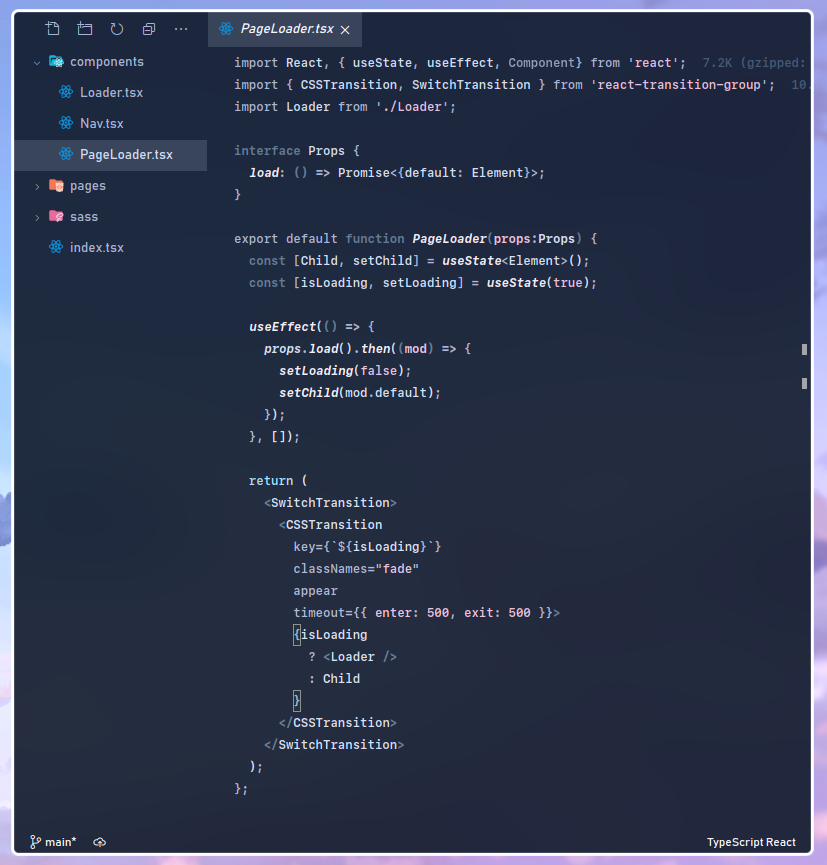
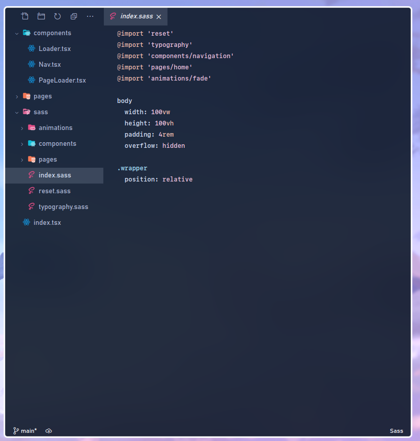

# Peace

**WIP**, Not published yet.

Minimal syntax highlighting theme for VS Code.  
Allows you to set your own colors.

Based on [this](https://ctrl-c.us/posts/highlight.html) philosophy.

The colors are upto you. You try to limit your usage of bright colors to 3-4 colors.
* Primary
* Secondary
* Accent
* Highlight, used very sparingly, think regex and escape chars

I'd love to be able to integrate Xresources or something similar into this some day.

## Installation

Clone this repo inside your extensions directory.

Set your color vars in `src/palette.js`.  

```sh
# Generates theme in themes/Peace-color-theme.json
$ node src/index.js

```

## Development
Open debug panel and run the `Debug` configuration to open a VSCode workspace with theme live reloading.
```sh
# Use nodemon for live reloads
$ npm i -g nodemon
$ nodemon src/index.js
```
## Screenshots



